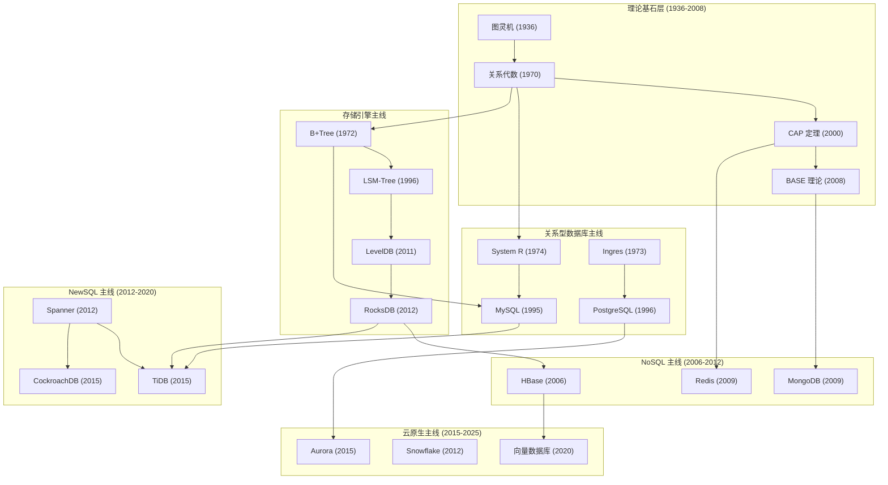

# 数据库技术发展史 (1936-2025)

## 技术演进总览图 (Mermaid Flowchart)
[](https://mermaid-live.nodejs.cn/edit#pako:eNp9lU1rE0EYx7_KMifFpOxrms1BaLaCQhvqTg5B18OaTJPQzU7ZF2ssPVhQD2JtqQVRMQcvXixKESQV_TLdRL-Fz8xsajJNuwR2J89_5vn_nnlmdxs1aYugCvLC9YBuNTt-lCj1ZS9U4IrTh-3I3-wo9Q6hUf--h8b7z_8cD7PBcDw4yb7tKtc02ygVdVUtX_fQAzGLXXUNxNn7X-On30cfhkImKXSmeHYyPjk9O_00OvrKRIuqJDJA5CytKdnxO0itXINMssQESXUJ31KEN6654EYpFm9CSnEzxM0UAhK2vFDidUngJ10a-sG5yezjSzA5enWcDQ_PfpyOh79nUrgMGPfjhPQUl6OYsx5cxnsnbEck5mFDCjPS1T6-u8KitiVFGeQajROYPpFI9XQFo2tMpxR_XQGKExr5bcIov7zNdj9nP49Gh3tz-DDjq96oR4Rw-_psdszoVvBqcSKQ7WHGt0IekWC5yrZI06Q4I3RpcyPO43ICgYcFEhZbiK8gq1EoFKzJ74og4r3B2lVevcboblf9mAiJFGVwLml1Yx61pSjfORq2qXA-HZ9rjGzlzvjDlDVNB2u61N8N3libfhiSaF5hGsxcvZtXTeqbBj8_UNWI-s3OJRpR2YZ-8S_jcgonoGkLFj8bHmR7g_GbwRSGxTCkLA7DWEojaLd5JhxGgUO6tR74G2Qep8NQsv2Dvy9en59Dppuu15TR_Ky72swQ50M8e1iwyYe1iVh0Vy2vSD2P5mLXmKlXPncydMXQyZeqiUSOgQqoHXVbqJJEKSmgHol6PhuibSb0UNIhPeKhCjy2yLqfBokHr-QdmAZbf4_S3mRmRNN2ZzJIN1t-Qpa7PmzKfwWUgUQOTcMEVXRL50ugyjZ6jCpFbbG0oBo2lLdk2CUdfgXUB5mxYJatkm3Bi9pSy7ap7xTQE55WW1DL0NSGZZqmVlI1QysgOAvw4lgVXw7-Adn5B7kk1rU)


---

## 术语缩写对照表

| 缩写 | 全称 | 中文含义 | 首次出现章节 |
|------|------|----------|--------------|
| **2PC** | Two-Phase Commit | 两阶段提交 | 分布式事务 |
| **2PL** | Two-Phase Locking | 两阶段锁 | 并发控制 |
| **3PC** | Three-Phase Commit | 三阶段提交 | 分布式事务 |
| **ACID** | Atomicity, Consistency, Isolation, Durability | 原子性、一致性、隔离性、持久性 | 事务基础 |
| **AOF** | Append Only File | 追加只写文件 | Redis 持久化 |
| **AP** | Availability, Partition tolerance | 可用性、分区容错性 | CAP 定理 |
| **BBU** | Battery Backup Unit | 电池备份单元 | 硬件持久化 |
| **BASE** | Basically Available, Soft state, Eventually consistent | 基本可用、软状态、最终一致性 | 分布式理论 |
| **B+Tree** | B-Plus Tree | B+ 树 | 存储引擎 |
| **CAP** | Consistency, Availability, Partition tolerance | 一致性、可用性、分区容错性 | 分布式理论 |
| **CP** | Consistency, Partition tolerance | 一致性、分区容错性 | CAP 定理 |
| **HTAP** | Hybrid Transactional/Analytical Processing | 混合事务/分析处理 | NewSQL |
| **LSM** | Log-Structured Merge-Tree | 日志结构合并树 | 存储引擎 |
| **MVCC** | Multi-Version Concurrency Control | 多版本并发控制 | 并发控制 |
| **NVDIMM** | Non-Volatile Dual In-line Memory Module | 非易失性双列直插内存模块 | 硬件持久化 |
| **OLAP** | Online Analytical Processing | 在线分析处理 | 数据库类型 |
| **OLTP** | Online Transaction Processing | 在线事务处理 | 数据库类型 |
| **RDB** | Redis Database | Redis 数据库快照 | Redis 持久化 |
| **SSTable** | Sorted String Table | 排序字符串表 | 存储引擎 |
| **TCC** | Try-Confirm-Cancel | 尝试 - 确认 - 取消 | 分布式事务 |
| **UUID** | Universally Unique Identifier | 通用唯一标识符 | 主键设计 |
| **WAL** | Write-Ahead Logging | 预写式日志 | 持久化 |
| **WCE** | Write Cache Enable | 写缓存启用 | 硬件持久化 |
| **X锁** | Exclusive Lock | 排它锁/写锁 | 锁机制 |
| **S 锁** | Shared Lock | 共享锁/读锁 | 锁机制 |

---

## 第一章：理论基础 (1936-1970)

### 1.1 图灵机 (1936)

**解决的问题**：什么是"可计算的"？

**解决方案**：
- 阿兰·图灵提出抽象计算模型
- 由无限长纸带、读写头、状态寄存器、控制规则组成
- 证明了存在"通用图灵机"可以模拟任何图灵机

**局限性**：
- 仅证明计算的可能性，不涉及效率
- 无法解决实际数据存储和管理问题

**与数据库的关联**：
- 为所有计算系统（包括数据库）奠定理论基础
- 关系数据库的查询语言（SQL）本质上是图灵完备的

---

### 1.2 关系代数 (1970, Edgar Codd)

**解决的问题**：
- 当时数据库采用层次/网状模型，数据结构复杂
- 用户需要理解物理存储细节
- 数据独立性差，修改 schema 影响应用程序

**解决方案**：
Codd 发表论文《A Relational Model of Data for Large Shared Data Banks》，提出：
- 数据用二维表（关系）表示
- 定义选择 (σ)、投影 (π)、连接 (⋈)、并 (∪)、差 (-) 等操作
- 数据与物理存储完全独立

**例子**：
```
学生表 (Students)              课程表 (Courses)
┌─────┬───────┐               ┌─────┬─────────┐
│ sid │ name  │               │ cid │ title   │
├─────┼───────┤               ├─────┼─────────┤
│ 1   │ Alice │               │ 101 │ Math    │
│ 2   │ Bob   │               │ 102 │ Physics │
└─────┴───────┘               └─────┴─────────┘

选课表 (Enrollments)
┌─────┬─────┐
│ sid │ cid │
├─────┼─────┤
│ 1   │ 101 │  ← Alice 选修 Math
│ 1   │ 102 │  ← Alice 选修 Physics
│ 2   │ 101 │  ← Bob 选修 Math
└─────┴─────┘

关系代数查询：找出选修 Math 的学生姓名
π_name(σ_cid=101(Students ⋈ Enrollments ⋈ Courses))
结果：{Alice, Bob}
```

**局限性**：
- 纯理论模型，无工程实现
- 未解决事务、并发控制问题
- 性能优化问题未涉及

**催生下一个技术**：需要将理论变为实际可用的数据库系统

---

## 第二章：关系型数据库崛起 (1970-1995)

### 2.1 System R (1974-1979, IBM)

**解决的问题**：关系代数如何工程实现？

**解决方案**：
- 第一个 SQL 实现
- 发明 B+Tree 索引
- 提出两阶段锁 (2PL) 并发控制
- 设计查询优化器（基于成本的优化）

#### 2.1.1 两阶段锁协议 (2PL - Two-Phase Locking)

**基本概念**：两阶段锁是一种并发控制协议，确保多个事务并发执行时的可串行化。协议规定事务的锁操作分为两个严格区分的阶段：
- **增长阶段 (Growing Phase)**：事务只能获得锁，不能释放任何锁
- **缩减阶段 (Shrinking Phase)**：事务只能释放锁，不能再获得新锁

**如何保证可串行化**：
- 2PL 通过锁定机制确保事务间操作的冲突顺序与某个串行执行顺序等价
- 关键定理：所有遵循 2PL 的事务调度都是冲突可串行化的
- 证明思路：2PL 确保事务的加锁顺序决定了冲突操作的执行顺序

**死锁问题**：
- 2PL 的副作用是可能产生死锁
- 死锁条件：事务 T1 持有 A 锁等待 B 锁，同时 T2 持有 B 锁等待 A 锁
- 解决方案：超时回滚、死锁检测、等待图 (Wait-Graph) 分析

**详细例子**：

考虑两个事务的冲突场景：
```
事务 T1: 读 A，写 B
事务 T2: 读 B，写 A
```

**场景 1：无锁并发导致数据不一致**
```
时间    事务 T1           事务 T2           数据状态
--------------------------------------------------------------
t1      读 A=100                          A=100, B=200
t2                      读 B=200          A=100, B=200
t3      写 B = A+50     → B=150           A=100, B=150  ← T1 的更新
t4                      写 A = B+30       A=230, B=150  ← T2 基于旧 B 值计算

问题：
- T2 读取的 B=200 是旧值，没有看到 T1 的更新 B=150
- 最终结果：A=230, B=150
- 如果串行执行 T1→T2：A=180, B=150
- 如果串行执行 T2→T1：A=230, B=260
- 并发执行结果与两种串行都不等价 → 不可串行化
```

**场景 2：使用 2PL 保证串行化但可能死锁**
```
采用严格 2PL（所有锁在提交时释放）：

时间    事务 T1                    事务 T2
--------------------------------------------------------------
t1      获得 S 锁 (A)，读 A=100
t2                              获得 S 锁 (B)，读 B=200
t3      申请 X 锁 (B) → 阻塞等待
                                申请 X 锁 (A) → 阻塞等待
t4      等待 T2 释放 B 锁          等待 T1 释放 A 锁
        ↓
        *** 死锁检测 ***

死锁检测算法（等待图）：
  T1 → T2  (T1 等待 T2 持有的 B 锁)
  T2 → T1  (T2 等待 T1 持有的 A 锁)
  形成环路 → 存在死锁

解决方案：选择 T1 回滚（牺牲代价较小的事务）
        T2 继续执行 → 获得 A 锁，完成事务
        T1 重试执行
```

**2PL 正确执行示例（无死锁情况）**：
```
时间    事务 T1                    事务 T2
--------------------------------------------------------------
t1      获得 S 锁 (A)，读 A=100
t2      获得 X 锁 (B)，写 B=150
t3      释放 S 锁 (A)              ← T1 进入缩减阶段
t4                              获得 S 锁 (B) → 阻塞（T1 持有 X 锁）
t5      释放 X 锁 (B)，提交
t6                              获得 S 锁 (B)，读 B=150
t7                              获得 X 锁 (A)，写 A=180
t8                              释放锁，提交

最终结果：A=180, B=150（等价于串行 T1→T2）
```

**性能影响**：
| 指标 | 无锁并发 | 2PL |
|------|----------|-----|
| 吞吐量 | 高（但结果错误） | 中（锁开销） |
| 正确性 | 无法保证 | 保证可串行化 |
| 死锁风险 | 无 | 有 |
| 并发度 | 高 | 受锁粒度限制 |

**优化建议**：
- 按固定顺序访问资源（如始终先 A 后 B）可避免死锁
- 使用细粒度锁（行锁 vs 表锁）提高并发
- 设置合理的锁超时时间
- 采用死锁检测 + 自动回滚机制

---

**例子 - B+Tree 索引**：
```
查找 sid=5 的学生：

       [根节点：5|15|25]
          /    |    \
   [1-4]  [5-14] [15-24] [25-30]  ← 叶节点（存数据）
     ↓      ↓       ↓       ↓
   磁盘块  磁盘块   磁盘块   磁盘块

只需 2 次 I/O（根节点 + 叶节点）即可定位
线性扫描需要遍历整张表
```

**局限性**：
- 仅限 IBM 内部使用
- 性能未达商业要求
- 未支持分布式

**技术传承**：
- SQL 成为标准查询语言
- B+Tree 成为后续所有关系数据库的索引基础

---

### 2.2 Ingres (1973, 伯克利)

**解决的问题**：System R 是闭源的，学术界需要开放替代方案

**解决方案**：
- 开源关系数据库原型
- 开发 QUEL 查询语言（SQL 的竞争对手）
- 培养大量数据库人才

**局限性**：
- QUEL 未成为标准（SQL 赢了）
- 性能不如商业产品

**技术传承**：
- 直接催生 PostgreSQL (1996)
- 培养 Michael Stonebraker（2014 图灵奖得主）

---

### 2.3 MySQL (1995)

**解决的问题**：
- 90 年代 Web 应用兴起，需要轻量级数据库
- Oracle/DB2 太沉重、昂贵
- 开源数据库空白

**解决方案**：
```
MySQL 架构
┌─────────────────────────────────┐
│           SQL Layer             │
│  解析器 | 优化器 | 缓存 | 事务   │
├─────────────────────────────────┤
│         存储引擎层               │
│  ┌──────┬──────┬──────┬─────┐  │
│  │MyISAM│InnoDB│Memory│... │  │
│  └──────┴──────┴──────┴─────┘  │
└─────────────────────────────────┘

特点：
- 存储引擎可插拔
- InnoDB 提供 ACID 事务（2001 年加入）
- 主从复制支持读写分离
```

**InnoDB 的 B+Tree 实现**：
```sql
CREATE TABLE users (
    id INT PRIMARY KEY,      -- 聚簇索引（数据即索引）
    name VARCHAR(100),
    email VARCHAR(100),
    INDEX idx_email (email)  -- 二级索引（指向主键）
) ENGINE=InnoDB;

-- 查询流程
SELECT * FROM users WHERE email = 'test@example.com';
1. 在 idx_email 二级索引找到对应 id=123
2. 回表到聚簇索引读取完整数据
```

**局限性**：
- 单表过大性能急剧下降（>1000 万行）
- 水平扩展困难（分库分表需应用层处理）
- 写并发受锁竞争限制

---

## 第三章：锁机制与并发控制

> **锁是数据库并发控制的基石**。本节深入剖析 MySQL、PostgreSQL、MongoDB 三大数据库的锁机制设计，揭示锁系统复杂性的根本原因，并详解死锁检测与避免策略。

### 3.1 为什么数据库锁如此复杂？

**问题的根源**：数据库锁设计的复杂性源于三个核心矛盾

```
矛盾 1：并发性能 vs 数据一致性
┌─────────────────────────────────────────┐
│  无锁：并发最高，数据可能不一致          │
│  全锁：数据一致，并发最低                │
│  目标：找到最佳平衡点                    │
└─────────────────────────────────────────┘

矛盾 2：锁粒度 vs 管理开销
┌─────────────────────────────────────────┐
│  粗粒度 (表锁)：管理简单，冲突概率高     │
│  细粒度 (行锁)：冲突概率低，管理复杂     │
└─────────────────────────────────────────┘

矛盾 3：隔离级别 vs 性能
┌─────────────────────────────────────────┐
│  Read Uncommitted → 几乎无锁，性能最高   │
│  Serializable     → 严格锁，性能最低     │
│  不同场景需要不同级别                   │
└─────────────────────────────────────────┘
```

**历史原因**：
```
MyISAM 时代 (1995-2001)
┌─────────────────────────────────────┐
│ 只支持表级锁                         │
│ 优点：实现简单，开销小               │
│ 缺点：写操作锁全表，并发差          │
└─────────────────────────────────────┘
          ↓
InnoDB 时代 (2001 年后)
┌─────────────────────────────────────┐
│ 支持行级锁 + 表级锁                  │
│ 优点：行级并发高                     │
│ 缺点：锁系统复杂，需要协调          │
└─────────────────────────────────────┘
```

---

### 3.2 MySQL 完整锁体系

#### 3.2.1 共享锁 (Shared Lock / S 锁) 与排它锁 (Exclusive Lock / X 锁)

**解决的问题**：读写操作的基本互斥需求

**原理**：
```
共享锁 (S 锁 / 读锁):
- 多个事务可同时持有同一资源的 S 锁
- S 锁与 S 锁兼容
- S 锁与 X 锁冲突

排它锁 (X 锁 / 写锁):
- 事务独占资源，不允许其他锁
- X 锁与任何锁都冲突
```

**锁兼容性矩阵**：

|      | X 锁    | S 锁    |
|------|---------|---------|
| X 锁 | 冲突    | 冲突    |
| S 锁 | 冲突    | 兼容    |

**详细例子**：

```sql
-- 示例 1：共享锁的兼容性演示
-- 事务 A
START TRANSACTION;
SELECT * FROM users WHERE id = 1 LOCK IN SHARE MODE;  -- 获取 S 锁
-- 事务 A 持有 S 锁期间...

-- 事务 B (可以同时执行)
START TRANSACTION;
SELECT * FROM users WHERE id = 1 LOCK IN SHARE MODE;  -- 获取 S 锁，成功！
-- 两个事务可以同时读取同一行

-- 事务 C (会被阻塞)
START TRANSACTION;
UPDATE users SET name = 'Charlie' WHERE id = 1;  -- 尝试获取 X 锁，阻塞！


-- 示例 2：排它锁的互斥性演示
-- 事务 A
START TRANSACTION;
UPDATE users SET name = 'Alice' WHERE id = 1;  -- 获取 X 锁
-- 事务 A 持有 X 锁期间...

-- 事务 B (会被阻塞)
START TRANSACTION;
SELECT * FROM users WHERE id = 1 LOCK IN SHARE MODE;  -- 尝试获取 S 锁，阻塞！

-- 事务 C (也会被阻塞)
START TRANSACTION;
UPDATE users SET name = 'Bob' WHERE id = 1;  -- 尝试获取 X 锁，阻塞！


-- 示例 3：锁的释放过程
-- 事务 A
START TRANSACTION;
UPDATE users SET balance = balance - 100 WHERE id = 1;  -- X 锁
UPDATE users SET balance = balance + 100 WHERE id = 2;  -- X 锁
COMMIT;  -- 所有锁在此刻释放

-- 锁的生命周期：
-- 1. 执行 UPDATE 时立即获取 X 锁
-- 2. 锁持续持有直到事务结束
-- 3. COMMIT/ROLLBACK 时释放所有锁
```

**与其他锁的关系**：是其他所有锁模式的基础

**局限性**：
- 仅靠 S/X 锁无法解决幻读问题
- 需要更细粒度的锁机制

---

#### 3.2.2 意向锁 (Intention Lock)

**解决的问题**：表级锁与行级锁的协调

**原理**：
```
意向锁是一种"预告"机制：
- 事务在获取行锁前，先在表级别声明"我打算锁行"
- 表锁可以检查意向锁，判断是否有行锁存在
- 避免表锁需要逐行检查是否有行锁

两种意向锁:
- IS (Intention Shared): 打算在某行上加 S 锁
- IX (Intention Exclusive): 打算在某行上加 X 锁
```

**意向锁兼容性矩阵**：

|      | IS    | IX    | S     | X     |
|------|-------|-------|-------|-------|
| IS   | 兼容  | 兼容  | 兼容  | 冲突  |
| IX   | 兼容  | 兼容  | 冲突  | 冲突  |
| S    | 兼容  | 冲突  | 兼容  | 冲突  |
| X    | 冲突  | 冲突  | 冲突  | 冲突  |

**详细例子**：

```sql
-- 示例 1：意向锁自动获取过程
-- 事务 A
START TRANSACTION;
UPDATE users SET name = 'Alice' WHERE id = 1;
/*
  InnoDB 自动执行:
  1. 在 users 表上获取 IX 锁 (意向排它锁)
  2. 在 id=1 的行上获取 X 锁
*/

-- 事务 B 尝试获取表锁
LOCK TABLES users WRITE;  -- 请求 X 锁 (表级)
-- 被阻塞！因为表上有 IX 锁

-- 示例 2：意向锁与共享锁的协调
-- 事务 A
START TRANSACTION;
SELECT * FROM users WHERE id = 1 LOCK IN SHARE MODE;
/*
  InnoDB 自动执行:
  1. 在 users 表上获取 IS 锁 (意向共享锁)
  2. 在 id=1 的行上获取 S 锁
*/

-- 事务 B
LOCK TABLES users READ;  -- 请求 S 锁 (表级)
-- 成功！IS 锁与 S 锁兼容

-- 示例 3：查看意向锁
SELECT * FROM performance_schema.data_locks WHERE OBJECT_SCHEMA = 'test';
/*
 返回结果示例:
 ENGINE TRANSACTION_ID TABLE_NAME INDEX_NAME LOCK_DATA LOCK_MODE
 -------- --------------- ---------- ---------- ---------- ----------
 INNODB  12345            users      NULL       NULL      IS
 INNODB  12345            users      PRIMARY    1         X
*/
```

**与其他锁的关系**：协调表锁与行锁的关键

**局限性**：
- 仅 InnoDB 支持
- 完全自动，用户无法直接控制

---

#### 3.2.3 元数据锁 (Metadata Lock)

**解决的问题**：保护表结构不被并发修改

**原理**：
```
当表有活跃事务时:
- 防止 DROP TABLE / ALTER TABLE 破坏正在执行的查询
- 防止 TRUNCATE 清空正在读取的数据

MDL 锁级别:
- MDL_SHARED_READ: 查询时获取
- MDL_SHARED_WRITE: DML 时获取
- MDL_SHARED_UPGRADABLE: 某些优化场景
- MDL_EXCLUSIVE: DDL 时获取
```

**详细例子**：

```sql
-- 示例 1：MDL 阻塞 DDL
-- 事务 A
START TRANSACTION;
SELECT * FROM users WHERE id = 1;
-- 持有 MDL_SHARED_READ 锁

-- 会话 B (会被阻塞)
ALTER TABLE users ADD COLUMN age INT;
-- 需要 MDL_EXCLUSIVE 锁
-- 阻塞等待事务 A 提交

-- 示例 2：MDL 导致的大范围阻塞
-- 长时间运行的查询
SELECT * FROM large_table WHERE complex_condition;
-- 持有 MDL_SHARED_READ

-- 此时以下操作都会被阻塞:
-- - ALTER TABLE large_table ...
-- - DROP TABLE large_table
-- - TRUNCATE TABLE large_table
-- - CREATE INDEX ON large_table ...

-- 示例 3：查看 MDL 锁
SELECT * FROM performance_schema.metadata_locks
WHERE OBJECT_SCHEMA = 'test' AND OBJECT_NAME = 'users';
/*
 返回:
 THREAD_ID EVENT_ID OBJECT_TYPE OBJECT_SCHEMA OBJECT_NAME LOCK_TYPE LOCK_STATUS
 --------- -------- ----------- ------------- ----------- --------- -----------
 45        123      TABLE       test          users       SHARED    GRANTED
 52        456      TABLE       test          users       EXCLUSIVE PENDING
*/
```

**与其他锁的关系**：独立于事务锁，由服务器层管理

**局限性**：
- 长查询可能导致 DDL 长时间阻塞
- MySQL 5.5+ 引入，之前版本存在更严重问题

---

#### 3.2.4 表级锁 (Table Lock)

**解决的问题**：简单场景下的快速锁定

**原理**：
```
MyISAM 时代的锁机制:
- LOCK TABLES ... READ/WRITE
- 一次性锁住整张表
- 实现简单，但并发性能差

使用场景:
- 批量数据导入
- 需要原子性的多表操作
- 维护操作
```

**详细例子**：

```sql
-- 示例 1：表锁的基本使用
LOCK TABLES users WRITE, orders READ;

-- 当前会话可以:
UPDATE users SET name = 'Alice' WHERE id = 1;  -- 写 users
SELECT * FROM orders WHERE user_id = 1;        -- 读 orders

-- 当前会话不可以:
SELECT * FROM products;  -- 未锁定 products!

-- 其他会话:
-- - 无法读写 users 表
-- - 可以读 orders 表
-- - 无法写 orders 表

UNLOCK TABLES;  -- 释放所有表锁


-- 示例 2：表锁 vs 行锁 性能对比
-- 场景：批量更新 10000 条记录

-- 方式 A：使用表锁 (适合批量操作)
LOCK TABLES users WRITE;
UPDATE users SET status = 1 WHERE id BETWEEN 1 AND 10000;
UNLOCK TABLES;
-- 优点：锁开销小，批量操作快
-- 缺点：期间其他人完全无法访问


-- 方式 B：使用行锁 (适合并发场景)
UPDATE users SET status = 1 WHERE id BETWEEN 1 AND 10000;
-- 优点：其他人可以访问其他行
-- 缺点：锁管理开销大，可能有死锁
```

**与其他锁的关系**：最粗粒度的锁，与意向锁配合

**局限性**：
- 并发性能差
- 写锁会阻塞所有读写

---

#### 3.2.5 行锁 (Row Lock)

**解决的问题**：高并发下的细粒度锁定

**原理**：
```
InnoDB 行锁实现:
- 锁在索引记录上，非索引列无法使用行锁
- 通过聚簇索引定位数据
- 二级索引需要"回表"

三种行锁算法:
1. Record Lock: 锁单条记录
2. Gap Lock: 锁间隙 (见下节)
3. Next-Key Lock: Record + Gap (组合)
```

**详细例子**：

```sql
-- 示例 1：行锁需要索引支持
CREATE TABLE users (
    id INT PRIMARY KEY,
    name VARCHAR(100),
    email VARCHAR(100),
    INDEX idx_email (email)
) ENGINE=InnoDB;

-- 使用索引，行锁生效
UPDATE users SET name = 'Alice' WHERE id = 1;        -- 锁 id=1 的行
UPDATE users SET name = 'Bob' WHERE email = 'a@b.com'; -- 锁对应行

-- 不使用索引，退化为表锁！
UPDATE users SET name = 'Charlie' WHERE name LIKE 'A%';  -- 全表扫描，锁所有行！


-- 示例 2：行锁的等待与释放
-- 事务 A
START TRANSACTION;
UPDATE users SET balance = balance - 100 WHERE id = 1;
-- 持有 id=1 的行锁

-- 事务 B (同时执行)
START TRANSACTION;
UPDATE users SET name = 'New Name' WHERE id = 1;
-- 被阻塞！等待事务 A 释放锁

-- 事务 A
COMMIT;  -- 释放锁

-- 事务 B 立即继续执行并提交


-- 示例 3：查看行锁信息
SELECT
    r.trx_id waiting_trx_id,
    r.trx_mysql_thread_id waiting_thread,
    r.trx_query waiting_query,
    b.trx_id blocking_trx_id,
    b.trx_mysql_thread_id blocking_thread,
    b.trx_query blocking_query
FROM information_schema.innodb_lock_waits r
INNER JOIN information_schema.innodb_trx b ON r.blocking_trx_id = b.trx_id;
/*
 返回:
 waiting_trx_id | waiting_thread | waiting_query          | blocking_trx_id | blocking_query
 ---------------|----------------|------------------------|-----------------|----------------
 12345          | 45             | UPDATE users SET ...   | 12344           | UPDATE users ...
*/
```

**与其他锁的关系**：与间隙锁组合成 Next-Key Lock

**局限性**：
- 必须有索引支持
- 无索引查询会锁全表

---

#### 3.2.6 间隙锁 (Gap Lock)

**解决的问题**：幻读 (Phantom Read)

**原理**：
```
幻读问题:
事务 A: SELECT * FROM users WHERE id > 5;  -- 返回 10 条
事务 B: INSERT INTO users VALUES (8, 'new');
事务 A: SELECT * FROM users WHERE id > 5;  -- 返回 11 条！(幻读)

间隙锁方案:
- 锁定索引记录之间的间隙
- 阻止其他事务在间隙中插入
- 与 Record Lock 组合为 Next-Key Lock
```

**详细例子**：

```sql
-- 准备数据
CREATE TABLE users (
    id INT PRIMARY KEY,
    name VARCHAR(100)
) ENGINE=InnoDB;

INSERT INTO users VALUES (1,'A'), (5,'E'), (10,'J'), (20,'T');
-- 索引结构：[1] --gap1-- [5] --gap2-- [10] --gap3-- [20]


-- 示例 1：间隙锁防止幻读
-- 事务 A (可重复读隔离级别)
START TRANSACTION;
SELECT * FROM users WHERE id > 5 AND id < 20 FOR UPDATE;
/*
 加锁情况:
 - Next-Key Lock on (5, 10]: 锁住 id=10 的记录 + (5,10) 间隙
 - Gap Lock on (10, 20): 锁住 (10,20) 间隙
 - 锁定范围：(5, 20)
*/

-- 事务 B 尝试插入
INSERT INTO users VALUES (8, 'new');   -- 被阻塞！(8 在 (5,20) 间隙内)
INSERT INTO users VALUES (15, 'mid');  -- 被阻塞！(15 在 (5,20) 间隙内)
INSERT INTO users VALUES (25, 'out');  -- 成功！(25 在锁定范围外)


-- 示例 2：间隙锁的边界情况
-- 事务 A
START TRANSACTION;
SELECT * FROM users WHERE id = 15 FOR UPDATE;
/*
  id=15 不存在，InnoDB 会:
  - 锁定 (10, 20) 间隙
  - 防止幻读插入
*/

-- 事务 B
INSERT INTO users VALUES (15, 'new');  -- 被阻塞！


-- 示例 3：完整时序图 - 间隙锁防止幻读
/*
时间线:
T1: 事务 A: SELECT * FROM users WHERE id > 5 FOR UPDATE;
    → 加锁：(5, +∞) 的 Next-Key Locks
    → 锁定间隙：(5,10), (10,20), (20,+∞)

T2: 事务 B: INSERT INTO users VALUES (8, 'phantom');
    → 被阻塞！id=8 落在 (5,10) 间隙

T3: 事务 C: INSERT INTO users VALUES (3, 'safe');
    → 成功！id=3 在锁定范围外

T4: 事务 A: SELECT * FROM users WHERE id > 5 FOR UPDATE;
    → 结果不变 (无幻读)

T5: 事务 A: COMMIT;
    → 释放所有间隙锁

T6: 事务 B: INSERT 成功执行
*/


-- 示例 4：查看间隙锁
SELECT * FROM performance_schema.data_locks;
/*
 返回:
 LOCK_TYPE  LOCK_MODE  LOCK_DATA
 ---------  ---------  ----------
 RECORD     X,GAP      5      ← Gap Lock
 RECORD     X          10     ← Record Lock
 RECORD     X          20     ← Record Lock
*/
```

**与其他锁的关系**：与 Record Lock 组合为 Next-Key Lock

**局限性**：
- 仅在 REPEATABLE READ 和 SERIALIZABLE 级别生效
- 降低并发性能
- 可能增加死锁概率

---

#### 3.2.7 自增锁 (Auto-inc Lock)

**解决的问题**：自增主键的并发安全

**原理**：
```
问题场景:
INSERT INTO t VALUES (NULL), (NULL), (NULL);
-- 如何保证三个 ID 连续且不重复？

锁模式 (innodb_autoinc_lock_mode):
- 0 (Traditional): 每条 INSERT 锁表
- 1 (Continuous): 批量插入时锁表
- 2 (Interleaved): 无锁，最高并发 (可能不连续)
```

**详细例子**：

```sql
-- 示例 1：自增锁的基本行为
CREATE TABLE orders (
    id INT AUTO_INCREMENT PRIMARY KEY,
    order_no VARCHAR(100)
) ENGINE=InnoDB;

-- 事务 A
INSERT INTO orders (order_no) VALUES ('A1'), ('A2'), ('A3');
-- 获取自增锁，分配 id=1,2,3

-- 事务 B (同时)
INSERT INTO orders (order_no) VALUES ('B1');
-- 等待事务 A 释放自增锁
-- 获得 id=4


-- 示例 2：不同锁模式的影响
-- 模式 0: Traditional (最安全，性能最差)
SET innodb_autoinc_lock_mode = 0;
INSERT INTO t VALUES (NULL, 'a'), (NULL, 'b');
-- 锁定整个表直到语句结束
-- 保证 ID 连续

-- 模式 1: Continuous (默认)
SET innodb_autoinc_lock_mode = 1;
INSERT INTO t VALUES (NULL, 'a'), (NULL, 'b');
-- 批量插入时锁表
-- 保证 ID 连续

-- 模式 2: Interleaved (最高并发)
SET innodb_autoinc_lock_mode = 2;
INSERT INTO t VALUES (NULL, 'a'), (NULL, 'b');
-- 无自增锁
-- ID 可能不连续：1,3,5,7...
```

**与其他锁的关系**：特殊的表级锁

**局限性**：
- 高并发下可能成为瓶颈
- 模式 2 下 ID 不连续

---

### 3.3 隔离级别与锁的关系

**MySQL 四种隔离级别**：

| 隔离级别 | 脏读 | 不可重复读 | 幻读 | 锁使用 |
|----------|------|------------|------|--------|
| READ UNCOMMITTED | 可能 | 可能 | 可能 | 最少 |
| READ COMMITTED | 不会 | 可能 | 可能 | 较少 |
| REPEATABLE READ (默认) | 不会 | 不会 | 不会 (MVCC+ 间隙锁) | 较多 |
| SERIALIZABLE | 不会 | 不会 | 不会 | 最多 |

**详细例子**：

```sql
-- 示例 1：READ COMMITTED - 只锁当前读
SET TRANSACTION ISOLATION LEVEL READ COMMITTED;

-- 事务 A
START TRANSACTION;
SELECT * FROM users WHERE id = 1;  -- 不加锁，快照读

-- 事务 B
UPDATE users SET name = 'new' WHERE id = 1;
COMMIT;

-- 事务 A
SELECT * FROM users WHERE id = 1;  -- 看到新数据！(可重复读级别看不到)


-- 示例 2：REPEATABLE READ - 间隙锁防止幻读
SET TRANSACTION ISOLATION LEVEL REPEATABLE READ;

-- 事务 A
START TRANSACTION;
SELECT * FROM users WHERE id > 5 FOR UPDATE;
-- 加间隙锁，锁定 (5, +∞)

-- 事务 B
INSERT INTO users VALUES (8, 'new');  -- 被阻塞


-- 示例 3：SERIALIZABLE - 所有读都加锁
SET TRANSACTION ISOLATION LEVEL SERIALIZABLE;

-- 事务 A
START TRANSACTION;
SELECT * FROM users WHERE id = 1;
-- 自动加 S 锁

-- 事务 B
UPDATE users SET name = 'new' WHERE id = 1;  -- 需要 X 锁，阻塞！
```

---

### 3.4 PostgreSQL 锁机制对比

#### 3.4.1 PostgreSQL 锁模式

**PostgreSQL 的锁模式更细粒度**：

| 锁模式 | 缩写 | 冲突锁模式 | 使用场景 |
|--------|------|------------|----------|
| AccessShareLock | ASL | RowExclusiveLock | SELECT |
| RowShareLock | RSL | ExclusiveLock, AccessExclusiveLock | SELECT FOR UPDATE |
| RowExclusiveLock | REL | ASL, RSL, SRL, EXCLUSIVE, AXSL | INSERT/UPDATE/DELETE |
| ShareUpdateExclusiveLock | SUEL | SUEL, SEL, EXCLUSIVE, AXSL | VACUUM |
| ShareLock | SL | REL, SUEL, SEL, EXCLUSIVE, AXSL | 外键约束 |
| ShareRowExclusiveLock | SREL | RSL, REL, SUEL, SEL, EXCLUSIVE, AXSL | 唯一约束检查 |
| ExclusiveLock | EL | RSL, REL, SUEL, SL, SREL, EXCLUSIVE, AXSL | 手动锁定 |
| AccessExclusiveLock | AXSL | 所有锁 | DROP TABLE, ALTER TABLE |

**PostgreSQL 锁兼容性矩阵**：

| 请求锁\已有锁 | ASL | RSL | REL | SUEL | SL | SREL | EL | AXSL |
|---------------|-----|-----|-----|------|----|------|----|------|
| ASL | ✓ | ✓ | ✓ | ✓ | ✓ | ✓ | ✓ | ✗ |
| RSL | ✓ | ✓ | ✓ | ✓ | ✓ | ✓ | ✗ | ✗ |
| REL | ✓ | ✓ | ✓ | ✓ | ✗ | ✗ | ✗ | ✗ |
| SUEL | ✓ | ✓ | ✓ | ✗ | ✗ | ✗ | ✗ | ✗ |
| SL | ✓ | ✓ | ✗ | ✗ | ✓ | ✗ | ✗ | ✗ |
| SREL | ✓ | ✓ | ✗ | ✗ | ✗ | ✗ | ✗ | ✗ |
| EL | ✓ | ✗ | ✗ | ✗ | ✗ | ✗ | ✗ | ✗ |
| AXSL | ✗ | ✗ | ✗ | ✗ | ✗ | ✗ | ✗ | ✗ |

#### 3.4.2 谓词锁 (Predicate Lock) vs 间隙锁

**解决的问题**：同样是防止幻读，但实现方式不同

**原理对比**：

```
间隙锁 (MySQL InnoDB):
┌─────────────────────────────────┐
│ 锁定索引记录之间的物理间隙       │
│ 实现简单，但可能过度锁定         │
│                                  │
│ 索引：[1] ---gap--- [5] ---gap--- [10]
│              ↑锁定这里             │
└─────────────────────────────────┘

谓词锁 (PostgreSQL):
┌─────────────────────────────────┐
│ 锁定满足查询条件的逻辑范围       │
│ 更精确，但实现复杂               │
│                                  │
│ WHERE id > 5 AND id < 10        │
│ 锁定所有满足此条件的记录         │
│ 包括当前存在的和未来插入的       │
└─────────────────────────────────┘
```

**详细例子**：

```sql
-- PostgreSQL 示例：谓词锁
BEGIN TRANSACTION ISOLATION LEVEL SERIALIZABLE;

-- 事务 A
SELECT * FROM users WHERE id > 5 AND id < 10 FOR UPDATE;
-- PostgreSQL 记录这个"谓词"(条件)
-- 任何满足 id > 5 AND id < 10 的操作都会被检查

-- 事务 B
INSERT INTO users VALUES (7, 'new');
-- PostgreSQL 检查：新记录满足谓词条件
-- 检测到冲突，可能回滚事务 B (序列化失败)


-- MySQL 示例：间隙锁
SET TRANSACTION ISOLATION LEVEL REPEATABLE READ;

-- 事务 A
SELECT * FROM users WHERE id > 5 AND id < 10 FOR UPDATE;
-- MySQL 锁定 (5, 10) 间隙

-- 事务 B
INSERT INTO users VALUES (7, 'new');
-- 直接阻塞，等待间隙锁释放
```

#### 3.4.3 MVCC 实现差异

**MVCC 对比表格**：

| 特性 | MySQL (InnoDB) | PostgreSQL |
|------|----------------|------------|
| MVCC 存储 | undo log | 多版本并存 |
| 旧版本位置 | undo 表空间 | 与原数据一起 |
| 空间效率 | 高 | 低 |
| VACUUM 需求 | 不需要 | 需要 |
| 读取旧版本 | 从 undo 恢复 | 直接读取旧元组 |
| 更新操作 | 原地更新 + undo | 插入新元组 + 标记旧版本 |
| 长期未提交事务影响 | undo 膨胀 | 表膨胀 |

**MVCC 原理对比**：

```
MySQL (InnoDB) MVCC:
┌─────────────────────────────────────┐
│ 当前数据：[id=1, name='Alice']      │
│              ↓                      │
│ 事务 A 更新：name='Bob'             │
│ 1. 原地修改数据为 'Bob'             │
│ 2. 旧版本 'Alice' 写入 undo log     │
│              ↓                      │
│ 事务 B 读取 (看到旧版本):           │
│ 从 undo log 恢复 'Alice'            │
└─────────────────────────────────────┘

PostgreSQL MVCC:
┌─────────────────────────────────────┐
│ 原始数据：[id=1, name='Alice',      │
│           xmin=100, xmax=0]         │
│              ↓                      │
│ 事务 A (xid=105) 更新：name='Bob'   │
│ 1. 插入新元组：[id=1, name='Bob',   │
│                xmin=105, xmax=0]    │
│ 2. 标记旧元组：[id=1, name='Alice', │
│                xmin=100, xmax=105]  │
│              ↓                      │
│ 事务 B (xid=102) 读取:              │
│ 看到 xmin=100, xmax=0 的元组        │
│ (事务 105 对事务 102 不可见)          │
└─────────────────────────────────────┘
```

**详细例子**：

```sql
-- MySQL: 查看 undo log 信息
SELECT
    TABLE_NAME,
    SPACE,
    FILE_PATH,
    TOTAL_ROW_VERSIONS
FROM information_schema.INNODB_METRICS
WHERE NAME LIKE '%undo%';


-- PostgreSQL: 查看多版本
SELECT
    ctid,           -- 元组物理位置
    xmin,           -- 插入事务 ID
    xmax,           -- 删除/更新事务 ID
    *
FROM users;

-- PostgreSQL: VACUUM 清理旧版本
VACUUM users;           -- 标记空间可重用
VACUUM FULL users;      -- 完全整理，回收空间
```

#### 3.4.4 PostgreSQL 死锁检测

```sql
-- PostgreSQL 死锁检测配置
SHOW deadlock_timeout;  -- 默认 1 秒
SHOW log_lock_waits;    -- 记录锁等待

-- 死锁检测日志示例:
-- LOG:  process 12345 detected deadlock while waiting for share lock

-- PostgreSQL 自动回滚代价较小的事务来打破死锁
```

---

### 3.5 MongoDB 锁机制演进

#### 3.5.1 数据库级锁 (早期版本 < 3.0)

**问题**：
```
MongoDB 2.x 及更早版本:
- 整个数据库一个写锁
- 读操作不需要锁 (读未提交语义)
- 写操作极度受限
```

#### 3.5.2 文档级锁 (3.0+)

**解决方案**：
```
MongoDB 3.0+:
- 引入 WiredTiger 存储引擎
- 文档级别的并发控制
- 使用 MVCC 实现乐观并发
```

**MongoDB 与 MySQL 锁对比**：

| 特性 | MySQL (InnoDB) | MongoDB (WiredTiger) |
|------|----------------|----------------------|
| 锁粒度 | 行级 | 文档级 |
| 写冲突 | 锁等待 | 乐观并发 (冲突重试) |
| 读一致性 | 隔离级别控制 | 读已提交 |
| 事务支持 | 完整 ACID | 4.0+ 支持多文档事务 |

**详细例子**：

```javascript
// MongoDB 写冲突处理
// 会话 A
db.users.updateOne(
    { _id: 1 },
    { $set: { name: "Alice" } }
);

// 会话 B (同时执行)
db.users.updateOne(
    { _id: 1 },
    { $set: { name: "Bob" } }
);

// WiredTiger 处理:
// 1. 两个操作同时尝试修改文档
// 2. 第一个成功提交
// 3. 第二个检测到冲突，自动重试
// 4. 重试时基于最新数据重新执行
// 5. 返回 WriteConflictError 如果多次重试失败
```

---

### 3.6 死锁检测与避免

#### 3.6.1 死锁产生的四个必要条件

```
1. 互斥条件：资源一次只能被一个事务使用
2. 占有并等待：事务持有资源的同时等待其他资源
3. 不可抢占：已分配的资源不能被强制抢占
4. 循环等待：存在事务等待的循环链

打破任一条件即可避免死锁
```

#### 3.6.2 MySQL 死锁检测

**原理**：
```
wait-for 图检测:
- 构建事务等待图
- 检测图中是否存在环
- 发现环后回滚代价最小的事务

检测时机:
- 每次锁等待时检查
- 开销随事务数增加而增加
```

**详细例子**：

```sql
-- 完整死锁时序图

-- 事务 A                          -- 事务 B
START TRANSACTION;                 START TRANSACTION;
                                   -- T1
UPDATE users SET a = 1 WHERE id = 1;
-- 获取 id=1 的 X 锁                -- T2
                                   UPDATE users SET b = 1 WHERE id = 2;
                                   -- 获取 id=2 的 X 锁
-- T3
UPDATE users SET a = 2 WHERE id = 2;
-- 等待 id=2 的锁 (B 持有)          -- T4
                                   UPDATE users SET b = 2 WHERE id = 1;
                                   -- 等待 id=1 的锁 (A 持有)

-- T5: MySQL 检测到死锁循环
-- A 等待 B, B 等待 A
-- 回滚其中一个事务

-- 死锁日志:
-- LATEST DETECTED DEADLOCK
-- TRANSACTION 1:
-- UPDATE users SET a = 2 WHERE id = 2
-- WAITING FOR THIS LOCK TO BE GRANTED:
-- RECORD LOCKS ... id=2
--
-- TRANSACTION 2:
-- UPDATE users SET b = 2 WHERE id = 1
-- HOLDS THE LOCK BUT WAITING FOR:
-- RECORD LOCKS ... id=1


-- 示例 2：间隙锁导致的死锁
-- 数据：users 表有 id=1, 10, 20 三条记录

-- 事务 A                          -- 事务 B
START TRANSACTION;                 START TRANSACTION;
                                   -- T1
SELECT * FROM users WHERE id = 5 FOR UPDATE;
-- 锁定间隙 (1, 10)                -- T2
                                   SELECT * FROM users WHERE id = 5 FOR UPDATE;
                                   -- 也尝试锁定间隙 (1, 10)
                                   -- 阻塞，等待 A
-- T3
INSERT INTO users VALUES (5, 'new');
-- 需要在间隙中插入
-- 等待 B 释放 (B 在等待间隙锁)

-- 死锁！
```

#### 3.6.3 PostgreSQL 死锁处理

```sql
-- PostgreSQL 死锁配置
SHOW deadlock_timeout;  -- 1 秒后检测死锁

-- 死锁日志 (当发生时):
-- ERROR:  deadlock detected
-- DETAIL:  Process 12345 waits for ShareLock on transaction 67890
--          Process 54321 waits for ShareLock on transaction 09876
-- HINT:  See server log for query details.

-- PostgreSQL 自动选择回滚代价较小的事务
```

#### 3.6.4 实际应用中的死锁避免策略

**策略 1：固定顺序访问**
```sql
-- 错误示例：可能导致死锁
-- 事务 A: UPDATE users SET ... WHERE id = 1; 然后 id = 2;
-- 事务 B: UPDATE users SET ... WHERE id = 2; 然后 id = 1;

-- 正确示例：固定按 id 升序访问
-- 事务 A: 先 id=1, 再 id=2
-- 事务 B: 先 id=1, 再 id=2
```

**策略 2：缩短事务**
```sql
-- 错误示例：长事务增加死锁概率
START TRANSACTION;
SELECT ...;  -- 持锁
-- 复杂业务逻辑...
-- 网络请求...
UPDATE ...;  -- 可能死锁
COMMIT;

-- 正确示例：缩短持锁时间
SELECT ...;  -- 快照读，不持锁
-- 复杂业务逻辑 (不持锁)
-- 网络请求 (不持锁)
START TRANSACTION;
UPDATE ...;  -- 快速执行
COMMIT;
```

**策略 3：使用较低隔离级别**
```sql
-- 如果业务允许，使用 READ COMMITTED
SET TRANSACTION ISOLATION LEVEL READ COMMITTED;
-- 减少间隙锁使用，降低死锁概率
```

**策略 4：应用层重试**
```python
# Python 示例：死锁重试机制
import time
from mysql.connector import OperationalError

def execute_with_retry(cursor, sql, params, max_retries=3):
    for i in range(max_retries):
        try:
            cursor.execute(sql, params)
            return
        except OperationalError as e:
            if e.errno == 1213:  # 死锁错误码
                if i < max_retries - 1:
                    time.sleep(0.1 * (2 ** i))  # 指数退避
                    continue
            raise
```

**策略 5：批量操作分片**
```sql
-- 错误示例：大事务
UPDATE users SET status = 1 WHERE id BETWEEN 1 AND 1000000;

-- 正确示例：分批执行
UPDATE users SET status = 1 WHERE id BETWEEN 1 AND 1000;
UPDATE users SET status = 1 WHERE id BETWEEN 1001 AND 2000;
...
```

---

## 第四章：存储引擎的演进 (1972-2012)

### 4.1 B-Tree / B+Tree (1972)

**解决的问题**：磁盘 I/O 效率优化

**核心思想**：
- 多路平衡查找树，降低树高
- 节点大小 = 磁盘页大小（4KB-16KB）
- 每次 I/O 读取整个节点

**B+Tree 特点**：
```
        [50|100|150]         ← 内部节点（只存索引）
       /   |   |   \
[1-49] [50-99] [100-149] [150-200]  ← 叶节点（存数据）
   └─────┴─────┴─────┘
         双向链表连接，支持范围查询

范围查询：SELECT * FROM t WHERE id BETWEEN 50 AND 120
→ 定位到 50，沿链表顺序扫描，无需回溯
```

#### 4.1.1 B+Tree 高度计算详解

**基本概念**：
- **树高度**：从根节点到叶节点的路径长度
- **扇出 (Fanout)**：每个节点平均能容纳的子节点数
- B+Tree 通过高扇出保持低高度，从而减少 I/O 次数

**计算公式**：
```
假设：
- 页大小 (Page Size) = P 字节
- 键大小 (Key Size) = K 字节
- 指针大小 (Pointer Size) = Ptr 字节
- 记录总数 = N

每个节点的键数量 (扇出)：fanout = P / (K + Ptr)
树高度：h = log_fanout(N)

查询 I/O 次数 ≈ h + 1（h 层内部节点 + 1 层叶节点）
```

**具体计算示例（InnoDB 默认配置）**：
```
假设条件：
- 页大小：16KB (InnoDB 默认)
- 主键：BIGINT (8 字节)
- 指针：6 字节
- 记录数：1 亿条

计算过程：
┌─────────────────────────────────────────────────────────────┐
│ 步骤 1: 计算每个节点能容纳的键数                              │
│ fanout = 16KB / (8 + 6) = 16384 / 14 ≈ 1170                 │
└─────────────────────────────────────────────────────────────┘
                              ↓
┌─────────────────────────────────────────────────────────────┐
│ 步骤 2: 计算各层能索引的记录数                                 │
│                                                             │
│ 第 0 层（根节点）：1 个节点                                   │
│ 第 1 层：1 × 1170 = 1,170 个节点                             │
│ 第 2 层：1,170 × 1170 ≈ 1,368,900 个节点（约 137 万）        │
│ 第 3 层：1,368,900 × 1170 ≈ 1,601,613,000（约 16 亿）        │
└─────────────────────────────────────────────────────────────┘
                              ↓
┌─────────────────────────────────────────────────────────────┐
│ 步骤 3: 确定树高度                                            │
│                                                             │
│ 1 亿条记录介于 137 万和 16 亿之间                              │
│ 因此需要 4 层（高度 = 3）                                    │
│                                                             │
│ 查询 I/O 次数 = 4 次（根节点 + 2 层内部节点 + 1 层叶节点）        │
└─────────────────────────────────────────────────────────────┘
```

**可视化结构**：
```
                    根节点 (Level 0)
                    [1 个节点]
                         │
              ┌──────────┼──────────┐
              ↓          ↓          ↓
         ┌─────────┬─────────┬─────────┐    Level 1
         │ 1170 个  │ 1170 个 │ 1170 个 │    (共 1170 个节点)
         └─────────┴─────────┴─────────┘
              │          │          │
              ↓          ↓          ↓
         ┌─────────┬─────────┬─────────┐    Level 2
         │ 137 万  │ 137 万  │ 137 万  │    (共 137 万个节点)
         └─────────┴─────────┴─────────┘
              │          │          │
              ↓          ↓          ↓
         ┌─────────┬─────────┬─────────┐    Level 3 (叶节点)
         │ 1.6 亿  │ 1.6 亿  │ 1.6 亿  │    (存储实际数据)
         └─────────┴─────────┴─────────┘

总记录容量：1170 × 1170 × 1170 ≈ 16 亿条
```

**为什么 B+Tree 能保持较低高度**：
```
对比二叉搜索树 (BST) vs B+Tree：

BST (扇出=2):
  log₂(1 亿) ≈ 27 层
  → 最坏需要 27 次 I/O

B+Tree (扇出=1170):
  log₁₁₇₀(1 亿) ≈ 3.2 层
  → 只需 4 次 I/O

关键原因：
- B+Tree 是多路树，扇出远大于 2
- 节点大小设计为磁盘页大小，充分利用每次 I/O
- 内部节点只存索引，不存数据，容纳更多键
```

**性能影响**：
| 记录数 | 树高度 | I/O 次数 | 查询延迟 (假设 10ms/I/O) |
|--------|--------|----------|-------------------------|
| 1 万 | 2 层 | 3 次 | ~30ms |
| 100 万 | 3 层 | 4 次 | ~40ms |
| 1 亿 | 4 层 | 5 次 | ~50ms |
| 100 亿 | 5 层 | 6 次 | ~60ms |

**优化建议**：
- 选择合适的主键类型（过长的主键降低扇出）
- 定期 OPTIMIZE TABLE 减少页分裂影响
- 监控表空间碎片率

---

#### 4.1.2 页分裂 (Page Split)

**基本概念**：
页分裂是 B+Tree 索引在插入数据时，当目标页已满无法容纳新记录时发生的现象。数据库需要将该页一分为二，以腾出空间插入新数据。

**为什么会发生**：
- B+Tree 的叶节点必须保持有序
- 当插入到已满页的中间位置时，无法简单地追加
- 必须分裂页以维持有序性

**详细图解示例**：

```
【初始状态】页 P1 已满（100% 利用率）
┌────────────────────────────────────────────────────────────┐
│  页 P1 (100% 满)                                            │
│  [1][2][3][4][5][6][7][8][9][10]                          │
│   ↑                                      ↑                │
│ 最小键=1                                最大键=10           │
└────────────────────────────────────────────────────────────┘
```

```
【插入操作】INSERT INTO t VALUES (5.5)

5.5 应该插入到 5 和 6 之间，但页 P1 已满
```

```
【分裂过程】

步骤 1: 创建新页 P2
步骤 2: 将 P1 后半部分数据移动到 P2
步骤 3: 更新父节点索引

分裂后状态：
                    父节点更新
                    [5 | 10]
                     /    \
                    ↓      ↓
┌─────────────────────┐  ┌─────────────────────┐
│   页 P1 (50% 满)     │  │   页 P2 (50% 满)     │
│   [1][2][3][4][5]   │  │   [6][7][8][9][10]  │
│         ↓           │  │                     │
│   插入 5.5 到这里    │  │                     │
└─────────────────────┘  └─────────────────────┘

最终状态（插入完成后）：
                    父节点
                    [5 | 10]
                     /    \
                    ↓      ↓
┌─────────────────────┐  ┌─────────────────────┐
│   页 P1 (60% 满)     │  │   页 P2 (50% 满)     │
│ [1][2][3][4][5][5.5]│  │   [6][7][8][9][10]  │
└─────────────────────┘  └─────────────────────┘
```

**页分裂的连锁反应**：
```
如果父节点也满了，会触发级联分裂：

        [根节点已满]
             │
      ┌──────┴──────┐
      ↓             ↓
   [P1 已满]     [P2 已满]
      │             │
   插入导致      无需分裂
   页分裂

分裂传导过程：
1. P1 分裂 → 需要更新父节点索引
2. 父节点已满 → 父节点也需要分裂
3. 如果父节点是根节点 → 树高度 +1

结果：
        [新根节点]
             │
      ┌──────┼──────┐
      ↓      ↓      ↓
   [旧根]  [新页]  [其他]
   分裂成两页
```

**性能影响**：

| 影响类型 | 说明 | 定量分析 |
|----------|------|----------|
| **写放大** | 1 次插入变成多次 I/O | 原本 1 次写入 → 分裂时 2-3 次写入（原页 + 新页 + 父节点更新） |
| **空间浪费** | 页利用率下降 | 100% → 50%，空间利用率降低一半 |
| **碎片化** | 物理存储不连续 | 长期运行后平均利用率可能降至 60-70% |
| **查询变慢** | 需要访问更多页 | 范围查询可能需要额外的 I/O |

**实际场景中的表现**：
```
场景：自增主键 vs 随机主键

1. 自增主键 (推荐)
   INSERT INTO users (name) VALUES ('Alice')  -- id=1
   INSERT INTO users (name) VALUES ('Bob')    -- id=2
   INSERT INTO users (name) VALUES ('Carol')  -- id=3

   数据顺序插入，总是在最后一页追加
   → 几乎不会触发页分裂
   → 页利用率接近 100%

2. 随机主键/UUID (不推荐)
   INSERT INTO users (id, name) VALUES ('550e8400-...', 'Alice')
   INSERT INTO users (id, name) VALUES ('123e4567-...', 'Bob')
   INSERT INTO users (id, name) VALUES ('999e9999-...', 'Carol')

   数据随机分布，每次插入可能在任意页的任意位置
   → 频繁触发页分裂
   → 页利用率可能降至 50-60%
   → 写放大 3-5 倍
```

**优化建议**：

| 策略 | 说明 | 效果 |
|------|------|------|
| **使用自增主键** | 避免随机插入 | 减少 90%+ 页分裂 |
| **调整填充因子** | 预留空闲空间（如 FILLFACTOR=90） | 减少分裂频率 |
| **定期优化表** | OPTIMIZE TABLE / ALTER TABLE ... ENGINE=InnoDB | 重建索引，消除碎片 |
| **批量导入排序** | 导入数据前先按主键排序 | 顺序插入，避免分裂 |
| **避免过长索引** | 减少索引列数量和长度 | 提高页容纳记录数 |

**检测页分裂的方法**：
```sql
-- MySQL/InnoDB
SHOW ENGINE INNODB STATUS\G
-- 查看 "LOG" 部分的页分裂统计

-- SQL Server
SELECT
    object_name(ips.object_id) AS table_name,
    ips.avg_fragmentation_in_percent,
    ips.page_count
FROM sys.dm_db_index_physical_stats(DB_ID(), NULL, NULL, NULL, 'DETAILED') ips
WHERE ips.avg_fragmentation_in_percent > 30;
-- 碎片率 > 30% 建议优化
```

**局限性**：
- **随机写问题**：插入非有序数据导致页分裂（详见 3.1.2 节）
- **写放大**：一次写入可能触发多次页分裂和合并
- **点查询慢**：树高 O(log_N M)，需要多次 I/O

**数据说明问题**：
```
假设 1 亿条记录，页大小 16KB：
- B+Tree 高度：log_1000(1 亿) ≈ 3 层（详见 3.1.1 节详细计算）
- 随机插入：每次可能需要分裂页，实际 I/O 是理论值 3-5 倍
- 顺序插入：性能接近理论值
```

---

### 4.2 LSM-Tree (1996, Patrick O'Neil)

**解决的问题**：B+Tree 的随机写性能问题

**核心思想**：
- 用顺序写代替随机写
- 内存 + 磁盘分层结构
- 后台异步合并（Compaction）

**LSM-Tree 架构**：
```
写入流程:
内存 (MemTable, 128MB)  --满-->  冻结 (Immutable MemTable)
                              ↓
                         刷写到磁盘 (SSTable Level 0)
                              ↓
                    后台 Compaction (L0 → L1 → L2 → ...)
                              ↓
                         删除旧文件

读取流程:
1. 先查 MemTable
2. 再查 Immutable MemTable
3. 从 L0 到 Ln 依次查找 SSTable 的 Bloom Filter 和数据
```

**性能对比**：
| 操作 | B+Tree | LSM-Tree |
|------|--------|----------|
| 顺序写 | 快 | 极快 |
| 随机写 | 慢（页分裂） | 快（转为顺序写） |
| 点查询 | O(log N) | O(k·log N)，k=层数 |
| 范围查询 | 快 | 较慢 |

**局限性**：
- **读放大**：可能需要查询多层 SSTable
- **空间放大**：多层数据冗余，临时文件占用
- **Compaction 开销**：后台合并占用 I/O

**技术传承**：直接催生 LevelDB 和 RocksDB

---

### 4.3 LevelDB (2011, Google)

**解决的问题**：LSM-Tree 的工程实现

**核心贡献**：
```cpp
// LevelDB 使用示例
leveldb::DB* db;
leveldb::Options options;
options.create_if_missing = true;
leveldb::DB::Open(options, "/tmp/testdb", &db);

db->Put(leveldb::WriteOptions(), "key", "value");
db->Get(leveldb::ReadOptions(), "key", &value);
```

**架构特点**：
- 单文件 SSTable 格式
- 后台 Compaction 策略（Level 式合并）
- Bloom Filter 加速读取

**局限性**：
- 单线程 Compaction
- 不支持列族（Column Family）
- 无内置并发控制

---

### 4.4 RocksDB (2012, Facebook)

**解决的问题**：LevelDB 的局限性

**改进点**：
| 特性 | LevelDB | RocksDB |
|------|---------|---------|
| Compaction 线程 | 单线程 | 多线程 |
| 列族支持 | ❌ | ✅ |
| 写入并发 | 低 | 高（Write Batch） |
| 可配置性 | 低 | 高（100+ 参数） |

**Compaction 优化**：
```
LevelDB:  单线程 Compaction → 写阻塞
RocksDB:  多线程 Compaction
  - Thread 1: L0 → L1
  - Thread 2: L1 → L2
  - Thread 3: L2 → L3
  → 写吞吐提升 5-10 倍
```

**列族示例**：
```cpp
// 一个数据库，多个列族，独立 Compaction
std::vector<std::string> column_families = {"default", "stats", "metadata"};
rocksdb::DB* db;
rocksdb::ColumnFamilyHandle *cf_stats, *cf_meta;
rocksdb::DB::Open(options, "/tmp/rocksdb", &handles);

// 分别写入不同列族
db->Put(WriteOptions(), handles[0], "data_key", "value");  // default
db->Put(WriteOptions(), handles[1], "user:123", "online"); // stats
db->Put(WriteOptions(), handles[2], "schema_version", "3"); // metadata
```

**局限性**：
- 嵌入式引擎，需要封装才能独立使用
- 调优参数复杂（100+ 配置项）

**技术传承**：
- HBase 底层存储
- Cassandra SSTable 格式
- 多种时序数据库基础

---

## 第五章：NoSQL 革命 (2006-2012)

### 5.1 CAP 定理 (2000, Eric Brewer)

**解决的问题**：分布式系统的理论边界

**核心内容**：
```
C (Consistency): 一致性 - 所有节点同一时刻看到相同数据
A (Availability): 可用性 - 每次请求都得到响应
P (Partition tolerance): 分区容错 - 网络分区时系统继续运行

定理：三者不可兼得，最多取二
```

**实际选择**：
| 数据库 | 选择 | 原因 |
|--------|------|------|
| MySQL | CA | 单机/主从，假设网络可靠 |
| HBase | CP | 保证一致性，分区时部分不可用 |
| Redis | AP | 保证可用，允许数据短暂不一致 |

**催生下一个技术**：BASE 理论放宽一致性要求

---

### 5.2 BASE 理论 (2008)

**解决的问题**：CAP 太严格，Web 应用可接受弱一致性

**核心思想**：
- **Basically Available**：基本可用
- **Soft state**：软状态（允许中间状态）
- **Eventually consistent**：最终一致性

**例子**：
```
微博发热门榜：
- 用户 A 看到某微博热度 10 万
- 用户 B 看到 10.1 万（毫秒级差异）
- 不影响业务，最终会一致

相比银行转账：
- 必须强一致性（不能 A 扣款 B 未收款）
- 不能用 BASE
```

---

### 5.3 HBase (2006)

**解决的问题**：
- 单机存储无法应对 PB 级数据
- MySQL 分库分表复杂度高
- 需要随机读写海量数据

**解决方案**：
```
HBase 架构
┌─────────────────────────────────────────┐
│           Client                        │
└─────────────────────────────────────────┘
              ↓
┌─────────────────────────────────────────┐
│         ZooKeeper (元数据)               │
└─────────────────────────────────────────┘
              ↓
┌─────────────────────────────────────────┐
│    HMaster (DDL、Region 分配)            │
└─────────────────────────────────────────┘
              ↓
┌─────────────────────────────────────────┐
│    RegionServer                          │
│  ┌─────────┬─────────┬─────────┐        │
│  │ Region  │ Region  │ Region  │        │
│  │  MemTable│ MemTable│ MemTable│        │
│  │    ↓    │    ↓    │    ↓    │        │
│  │ WAL     │ WAL     │ WAL     │        │
│  │ SSTable │ SSTable │ SSTable │        │
│  └─────────┴─────────┴─────────┘        │
│     (基于 HDFS, RocksDB 前身)             │
└─────────────────────────────────────────┘
```

**数据模型**：
```
表：users
RowKey: user_001
列族：info, stats

┌──────────┬────────────────────────────────────────┐
│ RowKey   │ info:name    │ info:age │ stats:login │
├──────────┼────────────────────────────────────────┤
│ user_001 │ "Alice"      │ 25       │ 100         │
│ user_002 │ "Bob"        │ 30       │ 200         │
└──────────┴────────────────────────────────────────┘

特点：
- 按 RowKey 字典序存储（设计关键）
- 列族物理分离，可独立 Compaction
- 稀疏表，空列不占空间
```

**底层存储**：
```
HFile (HBase SSTable 格式)
┌─────────────────────────────────┐
│        Data Block               │
│        (压缩存储)                │
├─────────────────────────────────┤
│     Bloom Filter Block          │
│     (快速判断 key 是否存在)        │
├─────────────────────────────────┤
│     Index Block                 │
│     (定位 Data Block)            │
├─────────────────────────────────┤
│     Metadata Block              │
└─────────────────────────────────┘
```

**局限性**：
- 高延迟（相比 Redis/内存数据库）
- 不支持复杂查询（无 SQL、无事务）
- 运维复杂度高

---

### 5.4 Redis (2009)

**解决的问题**：
- 需要微秒级响应的场景
- 缓存层与数据库分离
- 简单数据结构操作

**解决方案**：
```
Redis 架构
┌─────────────────────────────────────────┐
│         内存数据区                       │
│  ┌─────┬─────┬─────┬─────┬─────┐        │
│  │String│ List│ Set │Hash │ZSet │       │
│  └─────┴─────┴─────┴─────┴─────┘        │
├─────────────────────────────────────────┤
│         持久化层                          │
│  RDB(快照) │ AOF(追加日志)               │
└─────────────────────────────────────────┘
```

**数据结构示例**：
```redis
# String - 缓存
SET user:123:name "Alice"
GET user:123:name

# List - 消息队列
LPUSH queue:tasks "task1"
RPOP queue:tasks

# Hash - 对象存储
HSET user:123 name "Alice" age 25 email "alice@example.com"
HGETALL user:123

# ZSet - 排行榜
ZADD leaderboard 1000 "user1"
ZADD leaderboard 950 "user2"
ZREVRANGE leaderboard 0 9 WITHSCORES  # 前 10 名

# Set - 去重、交集
SADD tags:article1 "tech" "news"
SINTER tags:article1 tags:article2  # 共同标签
```

**持久化机制**：
```
RDB (Redis Database):
- 定期 fork 子进程，写时复制 (Copy-on-Write)
- 生成 dump.rdb 快照
- 优点：文件小、恢复快
- 缺点：可能丢失最后一次快照后的数据

AOF (Append Only File):
SET x 1  → 追加 "SET x 1\n" 到 AOF 文件
SET x 2  → 追加 "SET x 2\n" 到 AOF 文件
BGREWRITEAOF → 重写 AOF，合并为 "SET x 2\n"
- 优点：数据更安全
- 缺点：文件大、恢复慢
```

**局限性**：
- 内存成本限制数据规模
- 单线程模型（Redis 6.0 前）
- 复杂查询能力弱

**技术传承**：
- 缓存事实标准
- 分布式锁实现（Redlock）
- 消息队列（Streams）

---

## 第六章：NewSQL 与分布式数据库 (2012-2020)

### 6.1 Google Spanner (2012)

**解决的问题**：
- 需要全球分布式 + 强一致性
- 传统数据库无法水平扩展
- NoSQL 无法支持事务和 SQL

**核心创新**：
```
TrueTime API:
- 利用 GPS + 原子钟同步
- 时间不确定度区间 [earliest, latest]
- 事务提交时等待 uncertainty 窗口

示例:
Commit timestamp = [T_earliest, T_latest]
下一个事务开始时间 > T_latest

保证全球范围内严格顺序
```

**架构**：
```
Spanner 三层架构
┌─────────────────────────────────────────┐
│  SQL Layer (查询解析、优化)              │
├─────────────────────────────────────────┤
│  Tablet Layer (事务、锁)                 │
│  ┌─────────┬─────────┬─────────┐        │
│  │ Tablet  │ Tablet  │ Tablet  │        │
│  └─────────┴─────────┴─────────┘        │
├─────────────────────────────────────────┤
│  Paxos Group (共识复制)                  │
│  Zone 1    Zone 2    Zone 3             │
│  ┌──┐     ┌──┐     ┌──┐                │
│  │P1│←→  │P2│←→  │P3│  (Paxos 副本)    │
│  └──┘     └──┘     └──┘                │
└─────────────────────────────────────────┘
```

**局限性**：
- Google 内部使用，不开放
- 硬件依赖（GPS/原子钟）
- 写延迟较高（跨洲同步）

**技术传承**：CockroachDB、TiDB、YugabyteDB

---

### 6.2 TiDB (2015, PingCAP)

**解决的问题**：
- 中国企业需要 Spanner 能力的开源方案
- MySQL 无法水平扩展
- 实时 OLAP 需求

**架构**：
```
TiDB 架构
┌─────────────────────────────────────────┐
│          TiDB (SQL Layer, 无状态)       │
│  解析 | 优化 | 分布式执行                │
├─────────────────────────────────────────┤
│          PD (Placement Driver)          │
│  元数据 | 调度 | 时间戳分配              │
├─────────────────────────────────────────┤
│          TiKV (Key-Value, Raft)         │
│  ┌─────────────────────────────────┐    │
│  │  Region 1  │  Region 2  │ ...   │    │
│  │  (RocksDB) │  (RocksDB) │       │    │
│  └─────────────────────────────────┘    │
└─────────────────────────────────────────┘

写入流程:
1. TiDB 从 PD 获取时间戳 T
2. 写入 TiKV Region（Raft 复制）
3. 多 Region 事务用 Percolator 协议

读取流程:
1. PD 分配读时间戳
2. MVCC 读取对应版本数据
```

**HTAP 能力**：
```sql
-- OLTP 查询
SELECT balance FROM accounts WHERE id = 123;

-- OLAP 查询（列存加速）
SELECT AVG(balance), region FROM accounts GROUP BY region;

-- 两者可同时执行，互不干扰
```

**局限性**：
- 运维复杂度高于 MySQL
- 小数据量性能不如 MySQL
- 生态工具链待完善

---

## 第七章：云原生数据库 (2015-2025)

### 7.1 AWS Aurora (2015)

**解决的问题**：
- 云环境下存算不分离合适
- MySQL/PostgreSQL 复制延迟
- 存储扩展慢

**核心创新**：
```
Aurora 架构（存算分离）
┌─────────────────────┐
│   Compute Nodes     │  无状态，可弹性伸缩
│   (MySQL 兼容)       │
└──────────┬──────────┘
           │
           ↓
┌──────────┴──────────┐
│   Storage Cluster   │  跨 3 个 AZ，6 副本
│   ┌───┬───┬───┐     │
│   │AZ1│AZ2│AZ3│     │  写一副本成功即返回
│   └───┴───┴───┘     │  读多数副本
└─────────────────────┘

日志即数据库：
- 只将 redo log 发送到存储层
- 后台异步合并数据页
- 故障恢复并行重放日志
```

**性能提升**：
| 指标 | MySQL | Aurora |
|------|-------|--------|
| 写吞吐 | 基准 | 5 倍 |
| 故障恢复 | 分钟级 | 秒级 |
| 存储上限 | 64TB | 128TB |

---

### 7.2 向量数据库 (2020-2025)

**解决的问题**：
- AI 大模型兴起，需要向量相似度搜索
- 传统数据库无向量索引
- RAG 应用需要高效检索

**核心技术**：
```
向量索引方法
1. HNSW (Hierarchical Navigable Small World)
   - 多层图结构
   - 查询复杂度 O(log N)
   - 精度高，内存大

2. IVF-PQ (Inverted File + Product Quantization)
   - 先聚类再量化
   - 压缩率高
   - 适合大规模

示例：Pinecone / Milvus / Weaviate

INSERT INTO vectors (id, embedding)
VALUES (1, [0.1, 0.2, ..., 0.9]);

SELECT id, cosine_similarity(embedding, query_vec) as score
FROM vectors
ORDER BY score DESC
LIMIT 10;
```

---

## 技术演进关系总览

```
┌─────────────────────────────────────────────────────────────────────────┐
│                        数据库技术演进树 (1936-2025)                       │
├─────────────────────────────────────────────────────────────────────────┤
│                                                                         │
│ 理论层                                                                   │
│ 图灵机 → 关系代数 → CAP 定理 → BASE 理论                                   │
│    ↓          ↓           ↓          ↓                                  │
│    ↓          └─────┬─────┘          │                                  │
│    ↓                ↓                │                                  │
│    ↓          关系型数据库            │                                  │
│    ↓          System R → Ingres     │                                  │
│    ↓                ↓                │                                  │
│    ↓          MySQL ────┬───┘       │                                  │
│    ↓                ↓               │                                  │
│    ↓           存储引擎层           │                                  │
│    ↓         B+Tree → LSM-Tree     │                                  │
│    ↓           ↓          ↓        │                                  │
│    ↓      InnoDB    LevelDB → RocksDB                                  │
│    ↓                    ↓        │                                     │
│    ↓                    └───┬────┘                                     │
│    ↓                        ↓                                          │
│    └──────────────────→  NoSQL 数据库                                  │
│                        HBase    Redis                                  │
│                          ↓         │                                   │
│                          └────┬────┘                                   │
│                               ↓                                        │
│                         NewSQL 数据库                                   │
│                      Spanner → TiDB                                    │
│                           ↓                                            │
│                      云原生数据库                                       │
│                       Aurora 等                                        │
│                           ↓                                            │
│                      向量数据库                                         │
│                   Milvus/Pinecone                                     │
│                                                                         │
└─────────────────────────────────────────────────────────────────────────┘
```

---

## 关键技术对比总结

| 技术 | 诞生年份 | 核心创新 | 解决的问题 | 局限性 |
|------|----------|----------|------------|--------|
| 图灵机 | 1936 | 通用计算模型 | 计算理论基础 | 无工程实现 |
| 关系代数 | 1970 | 二维表 + 集合运算 | 数据抽象 | 无事务支持 |
| B+Tree | 1972 | 多路平衡树 | 磁盘 I/O 优化 | 随机写慢 |
| LSM-Tree | 1996 | 顺序写 + 后台合并 | 写吞吐优化 | 读放大 |
| MySQL | 1995 | 可插拔引擎 | 轻量级 RDBMS | 扩展性差 |
| HBase | 2006 | LSM+ 分布式 | PB 级存储 | 高延迟 |
| Redis | 2009 | 内存 + 丰富结构 | 微秒级响应 | 内存成本 |
| RocksDB | 2012 | 多线程 Compaction | 嵌入式 KV 存储 | 调优复杂 |
| TiDB | 2015 | Raft+HTAP | 分布式 + 事务 | 运维复杂 |
| Aurora | 2015 | 存算分离 | 云原生弹性 | 厂商锁定 |

---

## 技术传承关系

### MySQL 的传承
```
关系代数 (1970)
    ↓
System R (1974) → SQL 语言
    ↓
Ingres (1973) → B+Tree 索引
    ↓
MySQL (1995) + InnoDB 引擎 (2001)
    ↓
    ├─→ 主从复制 → 读写分离
    ├─→ 分库分表 → 水平扩展
    └─→ 局限性 → NewSQL (TiDB 等)
```

### Redis 的传承
```
内存计算概念 (1960s)
    ↓
实时数据库需求 (1990s)
    ↓
CAP 定理 (2000) → AP 选择
    ↓
BASE 理论 (2008) → 最终一致性
    ↓
Redis (2009)
    ↓
    ├─→ RDB/AOF 持久化
    ├─→ Redis Cluster (2015)
    └─→ Redis Streams (2018)
```

### HBase 的传承
```
B+Tree (1972)
    ↓
LSM-Tree (1996)
    ↓
Google Bigtable (2006)
    ↓
HBase (2006)
    ↓
    ├─→ HFile 存储格式
    ├─→ Region 分裂机制
    └─→ 底层存储 → RocksDB
```

### RocksDB 的传承
```
B+Tree (1972) → 随机写瓶颈
    ↓
LSM-Tree (1996)
    ↓
LevelDB (2011)
    ↓
RocksDB (2012)
    ↓
    ├─→ HBase 底层存储
    ├─→ Cassandra SSTable
    ├─→ 时序数据库 (InfluxDB 等)
    └─→ 向量数据库索引底层
```

---

## 附录 A：专题深入阅读

本章节整理了数据库核心技术专题，每个专题都有独立文档深入讲解。

### A.1 分布式事务专题

**核心内容**：
- 两阶段提交 (2PC) - 完整时序图与失败场景分析
- 三阶段提交 (3PC) - 超时自主决策机制
- TCC 模式 - 电商订单 + 库存 + 支付完整示例
- Percolator 事务模型 - Spanner/TiDB 的核心协议
- Spanner TrueTime - GPS+ 原子钟保证全球一致性
- MongoDB 事务 - 从单文档到多文档的演进

**详细文档**：`database_evolution_distributed_transactions.md`

---

### A.2 日志与持久化专题

**核心内容**：
- **MySQL 三日志系统**：
  - binlog：归档、复制、点对点恢复
  - redo log：崩溃恢复、WAL 实现
  - undo log：事务回滚、MVCC
- **两阶段提交详解**：为什么必须先 redo log (prepare) → binlog → redo log (commit)
- **WAL (Write-Ahead Logging)**：PostgreSQL 实现与对比
- **MongoDB Journal 机制**：WiredTiger 组提交优化
- **Checkpoint 机制**：MySQL/PostgreSQL/MongoDB 各自实现
- **宕机恢复流程**：三阶段恢复（分析→重做→撤销）
- **硬件配合**：BBU 电池、NVDIMM、磁盘缓存策略

**详细文档**：`database_history_log_and_persistence.md`

---

### A.3 共识机制与伸缩性专题

**核心内容**：
- **共识机制原理**：
  - Paxos 算法（Basic/Multi Paxos）
  - Raft 算法（领导者选举、日志复制）
  - ZAB 协议（ZooKeeper 原子广播）
- **一致性哈希**：虚拟节点与数据再平衡
- **Redis Cluster 扩容**：16384 槽、3 节点到 5 节点完整流程
- **MongoDB 分片与副本集**：片键选择、均衡器工作原理
- **分片再平衡**：增量同步、限流控制、在线服务保证

**详细文档**：`consensus_and_scalability.md`

---

### A.4 MongoDB 与四数据库对比专题

**核心内容**：
- **MongoDB 技术路线**：2009-2023 年 7 个里程碑事件
- **数据模型对比**：BSON 文档 vs 关系表 vs JSONB vs 键值
- **存储引擎对比**：WiredTiger LSM-Tree vs InnoDB B+Tree vs Heap vs 内存
- **事务能力对比**：ACID 完整支持度对比
- **锁机制对比**：文档级锁 vs 行锁 vs 谓词锁 vs 单线程
- **扩展方式对比**：分片 vs 主从 + 分库分表 vs Cluster
- **典型应用场景**：博客平台、电商库存、实时排行榜完整案例

**详细文档**：`database_history_mongodb.md`

---

### A.5 术语缩写对照表

| 缩写 | 全称 | 中文含义 |
|------|------|----------|
| **2PC** | Two-Phase Commit | 两阶段提交 |
| **2PL** | Two-Phase Locking | 两阶段锁 |
| **3PC** | Three-Phase Commit | 三阶段提交 |
| **ACID** | Atomicity, Consistency, Isolation, Durability | 原子性、一致性、隔离性、持久性 |
| **AOF** | Append Only File | 追加只写文件 |
| **AP** | Availability, Partition tolerance | 可用性、分区容错性 |
| **BBU** | Battery Backup Unit | 电池备份单元 |
| **BASE** | Basically Available, Soft state, Eventually consistent | 基本可用、软状态、最终一致性 |
| **B+Tree** | B-Plus Tree | B+ 树 |
| **CAP** | Consistency, Availability, Partition tolerance | 一致性、可用性、分区容错性 |
| **CP** | Consistency, Partition tolerance | 一致性、分区容错性 |
| **HTAP** | Hybrid Transactional/Analytical Processing | 混合事务/分析处理 |
| **LSM** | Log-Structured Merge-Tree | 日志结构合并树 |
| **MVCC** | Multi-Version Concurrency Control | 多版本并发控制 |
| **NVDIMM** | Non-Volatile Dual In-line Memory Module | 非易失性双列直插内存模块 |
| **OLAP** | Online Analytical Processing | 在线分析处理 |
| **OLTP** | Online Transaction Processing | 在线事务处理 |
| **RDB** | Redis Database | Redis 数据库快照 |
| **SSTable** | Sorted String Table | 排序字符串表 |
| **TCC** | Try-Confirm-Cancel | 尝试 - 确认 - 取消 |
| **UUID** | Universally Unique Identifier | 通用唯一标识符 |
| **WAL** | Write-Ahead Logging | 预写式日志 |
| **WCE** | Write Cache Enable | 写缓存启用 |
| **X 锁** | Exclusive Lock | 排它锁/写锁 |
| **S 锁** | Shared Lock | 共享锁/读锁 |

---

## 附录 B：核心概念深化

### B.1 两阶段锁 (2PL) 详解

**基本概念**：两阶段锁是并发控制协议，确保事务的可串行化调度。

**两阶段定义**：
1. **增长阶段 (Growing Phase)**：事务只能获得锁，不能释放任何锁
2. **缩减阶段 (Shrinking Phase)**：事务只能释放锁，不能再获得新锁

**详细例子**：

```
场景：事务 T1 读 A 写 B，事务 T2 读 B 写 A

【无锁并发 - 导致数据不一致】
时间   T1                  T2
T1    读 A (值=100)
T2              读 B (值=200)
T1    写 B (值=200)
T2              写 A (值=100)
结果：丢失更新问题！

【使用 2PL - 保证串行化但可能死锁】
时间   T1                  T2
T1    S 锁 (A) 读 A
T2              S 锁 (B) 读 B
T1    X 锁 (B) ← 等待 T2
T2    X 锁 (A) ← 等待 T1
结果：死锁！需要检测并回滚其中一个事务
```

**性能影响**：
| 指标 | 无锁并发 | 2PL |
|------|----------|-----|
| 吞吐量 | 高（但结果错误） | 中（锁开销） |
| 正确性 | 无法保证 | 保证可串行化 |
| 死锁风险 | 无 | 有 |
| 并发度 | 高 | 受锁粒度限制 |

---

### B.2 B+Tree 高度计算

**计算公式**：
- 每个节点的键数量 (扇出)：`fanout = P / (K + Ptr)`
- 树高度：`h = log_fanout(N)`
- 查询 I/O 次数 ≈ h + 1

**具体计算示例（InnoDB 默认配置）**：
```
假设条件：
- 页大小：16KB (InnoDB 默认)
- 主键：BIGINT (8 字节)
- 指针：6 字节
- 记录数：1 亿条

计算过程：
1. 每个节点能容纳的键数：fanout = 16KB / (8+6) ≈ 1170
2. 根节点扇出：1170
3. 第一层能索引的记录数：1170
4. 第二层能索引的记录数：1170 × 1170 ≈ 137 万
5. 第三层能索引的记录数：1170 × 137 万 ≈ 16 亿

结论：1 亿条记录只需 3-4 层，即 3-4 次 I/O
```

**可视化结构**：
```
                    根节点 (Level 0)
                         │
              ┌──────────┼──────────┐
              ↓          ↓          ↓
         Level 1 (1170 个节点)
              ↓
         Level 2 (137 万个节点)
              ↓
         Level 3 叶节点 (存储 16 亿条数据)
```

**与二叉搜索树对比**：
- BST：log₂(1 亿) ≈ 27 层 → 27 次 I/O
- B+Tree：log₁₁₇₀(1 亿) ≈ 3.2 层 → 4 次 I/O

---

### B.3 页分裂 (Page Split) 详解

**基本概念**：当数据页已满且需要在页中间插入数据时，B+Tree 将页一分为二的过程。

**详细图解示例**：

```
【初始状态】页 P1 已满（100% 利用率）
┌─────────────────────────────────────────────────┐
│  页 P1: [1][2][3][4][5][6][7][8][9][10]         │
└─────────────────────────────────────────────────┘

【插入 5.5（介于 5 和 6 之间）】触发页分裂
                    父节点 [5 | 10]
                     /    \
                    ↓      ↓
┌─────────────────────┐  ┌─────────────────────┐
│   页 P1 (60% 满)     │  │   页 P2 (50% 满)     │
│ [1][2][3][4][5][5.5]│  │   [6][7][8][9][10]  │
└─────────────────────┘  └─────────────────────┘
```

**级联分裂**：如果父节点也满了，会触发向上一层的分裂，极端情况下可能导致树高度增加。

**性能影响定量分析**：
| 影响类型 | 说明 | 定量分析 |
|----------|------|----------|
| 写放大 | 1 次插入变成多次 I/O | 原本 1 次写入 → 分裂时 2-3 次写入 |
| 空间浪费 | 页利用率下降 | 100% → 50%，空间利用率降低一半 |
| 碎片化 | 物理存储不连续 | 长期运行后平均利用率可能降至 60-70% |

**实际场景对比**：
| 插入模式 | 页分裂频率 | 页利用率 | 写放大 |
|----------|------------|----------|--------|
| 自增主键（顺序） | 几乎不发生 | ~95% | 1x |
| 随机主键/UUID | 频繁触发 | ~50-60% | 3-5x |

**检测页分裂的 SQL 方法**：
```sql
-- MySQL/InnoDB
SHOW ENGINE INNODB STATUS\G
-- 查看 "TRANSACTIONS" 部分的页分裂统计

-- SQL Server
SELECT
    index_level,
    page_count,
    avg_page_space_used_in_percent,
    fragment_count
FROM sys.dm_db_index_physical_stats(DB_ID(), NULL, NULL, NULL, 'DETAILED');
```

---

## 附录 C：四数据库横向对比总览

| 维度 | MongoDB | MySQL | PostgreSQL | Redis |
|------|---------|-------|------------|-------|
| **数据模型** | BSON 文档 | 关系表 | 关系表 + JSONB | 键值 + 数据结构 |
| **存储引擎** | WiredTiger (LSM) | InnoDB (B+Tree) | Heap + TOAST | 内存 |
| **事务支持** | 4.0+ 多文档事务 | ACID 完整支持 | ACID + 可串行化 | 单命令原子性 |
| **锁机制** | 文档级锁 | 行锁/表锁/元数据锁 | 谓词锁/行锁 | 单线程无锁 |
| **持久化** | Journal + RDB | redo log + binlog | WAL | RDB/AOF |
| **扩展方式** | 分片 + 副本集 | 主从 + 分库分表 | 主从 + 插件 | Cluster 分片 |
| **一致性模型** | 最终一致 (可配置) | 强一致 | 强一致 | AP 模型 |
| **典型延迟** | 5-20ms | 1-10ms | 1-10ms | 0.1-1ms |
| **适用数据量** | GB-TB 级 | GB-TB 级 | GB-TB 级 | MB-GB 级 |
| **典型场景** | 内容管理/目录 | OLTP | 复杂查询/OLAP | 缓存/队列/排行榜 |

---

## 附录 D：技术选型决策树

```
开始选型
    │
    ├── 需要微秒级响应？ ──YES──→ Redis
    │       │
    │       NO
    │       │
    ├── 需要复杂 SQL 查询？ ──YES──→ PostgreSQL
    │       │
    │       NO
    │       │
    ├── Schema 频繁变化？ ──YES──→ MongoDB
    │       │
    │       NO
    │       │
    ├── 需要水平扩展？ ──YES──→ TiDB / CockroachDB
    │       │
    │       NO
    │       │
    └── 默认选择 ──→ MySQL (生态最成熟)
```

**组合使用模式**：
```
典型架构：
                    ┌─────────────┐
                    │    Redis    │ ← 缓存层
                    └──────┬──────┘
                           │
                    ┌──────┴──────┐
                    │   MySQL     │ ← OLTP 业务
                    └──────┬──────┘
                           │
                    ┌──────┴──────┐
                    │  PostgreSQL │ ← 复杂分析
                    └─────────────┘
```
